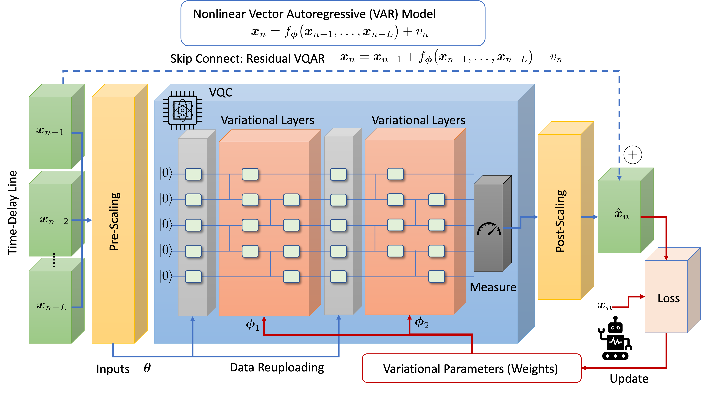
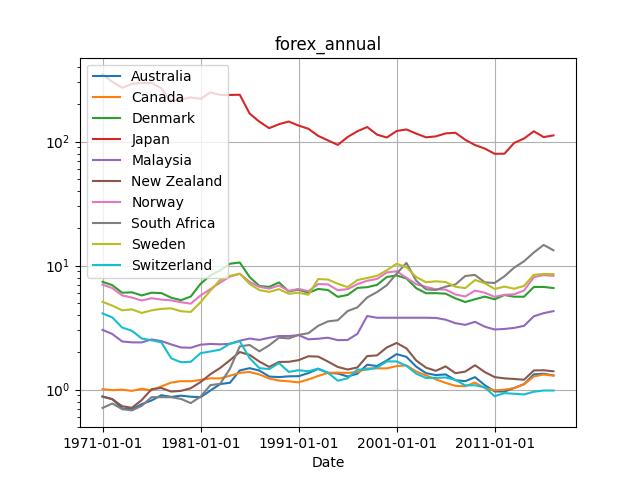
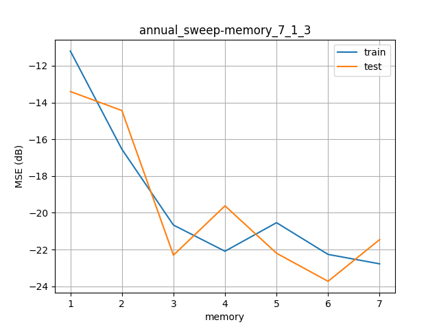
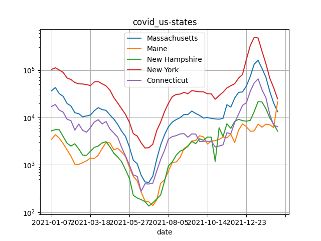
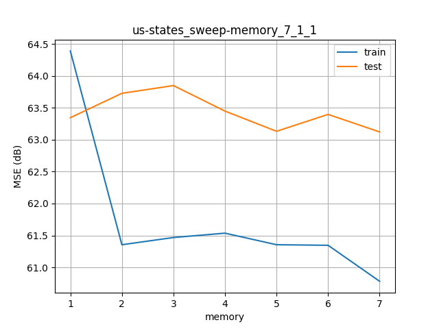

# VQAR: Variational Quantum Autoregressive

This project is to demonstrate **variational quantum autoregressive (VQAR)** model as a *quantum machine learning (QML)* method to forecast data trends (such as foreign exchange and COVID-19 cases), submitted under an open hackathon in [QHack 2022](https://github.com/XanaduAI/QHack).


## Methodology

VQAR is a **variational quancum circuit (VQC)**-based [autoregressive (AR) model](https://en.wikipedia.org/wiki/Autoregressive_model), also related to [nonlinear autoregressive exogenous (NARX)](https://en.wikipedia.org/wiki/Nonlinear_autoregressive_exogenous_model) to predict future trend.

A schematic is illustrated below. 
A time-series vector input is time-delayed to feed into VQC, and the output of VQC is a prediction of future data. 
The input data is optionally pre-scaled as an angle value to embed into VQC gates, while the quantum measurement is also optionally post-scaled. 
The VQC uses variational parameters to be trained such that the prediction loss is minimized.
We may use a VQC ansatz, e.g., based on [2-design](https://arxiv.org/abs/2001.00550) and [data reuploading](https://arxiv.org/abs/1907.02085).
An option with skip connection will model residual nonlinear VAR.


## Prerequiste

Use the package manager [pip](https://pip.pypa.io/en/stable/) for python=3.9.
We builds VQAR model using [Pennylane](https://pennylane.ai/).
```bash
pip install pennylane=0.21.0
pip install matplotlib=3.5.1
pip install pandas=1.4.1
pip install scikit-learn=1.0.2
pip install tqdm=4.62.3
pip install argparse
```
Other versions should work.

# Demo 1: Quantum Forex Forecasting

The first demo is to predict a financial trend, focusing on **foreign exchange** (a.k.a. forex or FX).


## Forex Dataset

We use a submodule [exchange-rates](https://github.com/datasets/exchange-rates) licensed under the [PDDL](https://opendatacommons.org/licenses/pddl/1-0/).

To update the data, run as
```bash
pip install dataflows
git submodule update --remote exchange-rates
python exchange-rates/exchange_rates_flow.py
```

There are 'annual', 'monthly', and 'daily' datasets from 1971 to 2018 for some countries:
- exchange-rates/data/annual.csv
- exchange-rates/data/monthly.csv
- exchange-rates/data/daily.csv 

A wrapper to load the data is [forex_loader.py](forex_loader.py).
E.g., select 'monthly' data for Australia and Canada for dates from 1980 to 2011/05:
```bash
python forex_loader.py --data monthly --country Australia Canada --dates 1980 2011/05
```


## Usage

For example, to predict Denmark and Sweden currencies from USD, you may run [quforex.py](quforex.py) as 
```bash
python quforex.py --data annual --country Denmark Sweden --memory 2 --epoch 100
```

To sweep memory, layer, and reuploading parameters of VQAR, you may run [quforex_sweep.py](quforex_sweep.py) as
```bash
python quforex_sweep.py --target memory --sweep 1 2 3 4 5 6 --reup 3
```
It will save results in plots/annual_sweep-memory_6_1_2.png.

## Performance

Example performance for Canada/US rate, you may run
```bash
python quforex_sweep.py --target memory --sweep 1 2 3 4 5 6 7 --reup 3 --layer 1 --data annual --country Canada
```
The prediction performance in mean-square error (MSE) improves with the VQAR memory:



Optimized VQC may look like:
```python
 0: ──RY(2.06)────╭C──RY(1.62)─────RY(2.06)──────────────────────────╭C──RY(-0.322)───RY(2.06)──────────────────────────╭C──RY(0.901)────────────────────┤ ⟨Z⟩ 
 1: ──RY(0.0649)──╰Z──RY(-0.612)──╭C─────────RY(1.74)────RY(0.0649)──╰Z──RY(-0.384)──╭C─────────RY(0.0422)──RY(0.0649)──╰Z──RY(-0.684)──╭C──RY(-0.692)───┤ ⟨Z⟩ 
 2: ──RY(-1.61)───╭C──RY(-0.528)──╰Z─────────RY(-0.761)──RY(-1.61)───╭C──RY(1.13)────╰Z─────────RY(0.583)───RY(-1.61)───╭C──RY(-0.123)──╰Z──RY(-0.397)───┤ ⟨Z⟩ 
 3: ──RY(0.939)───╰Z──RY(-1.07)───╭C─────────RY(0.319)───RY(0.939)───╰Z──RY(-1.1)────╭C─────────RY(-1.1)────RY(0.939)───╰Z──RY(-0.936)──╭C──RY(-0.687)───┤ ⟨Z⟩ 
 4: ──RY(0.196)───╭C──RY(0.865)───╰Z─────────RY(-0.249)──RY(0.196)───╭C──RY(-0.172)──╰Z─────────RY(1.14)────RY(0.196)───╭C──RY(-0.268)──╰Z──RY(-0.845)───┤ ⟨Z⟩ 
 5: ──RY(0.264)───╰Z──RY(-2.3)────╭C─────────RY(1.46)────RY(0.264)───╰Z──RY(-0.878)──╭C─────────RY(0.902)───RY(0.264)───╰Z──RY(0.53)────╭C──RY(-0.671)───┤ ⟨Z⟩ 
 6: ──RY(-0.641)──────────────────╰Z─────────RY(-2.06)───RY(-0.641)──────────────────╰Z─────────RY(0.502)───RY(-0.641)──────────────────╰Z──RY(-0.0127)──┤ ⟨Z⟩ 

```

# Demo 2: Quantum COVID-19 Forecasting

The second demo is to predict **COVID-19 cases**.

<!--

-->


## COVID-19 Dataset

We use a submodule [nytimes/covid-19-data](https://github.com/nytimes/covid-19-data) licensed under the [CC-BY NC](https://creativecommons.org/licenses/by-nc/4.0/legalcode). There are data from The New York Times, based on reports from state and local health agencies

To update the data, run as
```bash
git submodule update --remote covid-19-data
```
We use CSV files:
- covid-19-data/us.csv: daily US-nationwide cases
- covid-19-data/us-states.csv: daily US state-wise cases

Note that the data are cummurative sum.
A wrapper to load the data is [covid_loader.py](covid_loader.py), which may convert to daily/weekley diff (with --periods and --decimate):
```bash
python covid_loader.py --periods 7 --decimate 7 --states Massachusetts Maine 'New Hampshire' 'New York' Connecticut
```



## Usage

You may run [qucovid.py](./qucovid.py) as
```bash
python qucovid.py --memory 2 --states Massachusetts
```

## Performance

Example results when running [qucovid_sweep.py](./qucovid_sweep.py) as
```bash
python qucovid_sweep.py --verb --target memory --reup 1 --memory 2 --layer 1 --sweep 1 2 3 4 5 6 7 --states Connecticut --lr 1e-2
```
may look like as below. Training MSE improves with memory size, whereas testing MSE is not improved.



Optimized VQC circuits:
```python
 0: ──RY(-0.997)──╭C──RY(1.62)────────────────────┤ ⟨Z⟩ 
 1: ──RY(-0.107)──╰Z──RY(-0.612)──╭C──RY(1.74)────┤ ⟨Z⟩ 
 2: ──RY(1.45)────╭C──RY(-0.528)──╰Z──RY(-0.761)──┤ ⟨Z⟩ 
 3: ──RY(-0.618)──╰Z──RY(-1.07)───╭C──RY(0.319)───┤ ⟨Z⟩ 
 4: ──RY(-2.04)───╭C──RY(0.865)───╰Z──RY(-0.249)──┤ ⟨Z⟩ 
 5: ──RY(-1.94)───╰Z──RY(-2.3)────╭C──RY(1.46)────┤ ⟨Z⟩ 
 6: ──RY(-2.51)───────────────────╰Z──RY(-2.06)───┤ ⟨Z⟩ 
```

## Support

Note that we do not guarantee to achieve quantum advantage.
We do not intend to maintain this project for future.


## License

[MIT](https://choosealicense.com/licenses/mit/).
Copyright (c) 2022 Toshi Koike-Akino.
This project is provided 'as-is', without warranty of any kind. In no event shall the authors be liable for any claims, damages, or other such variants.
